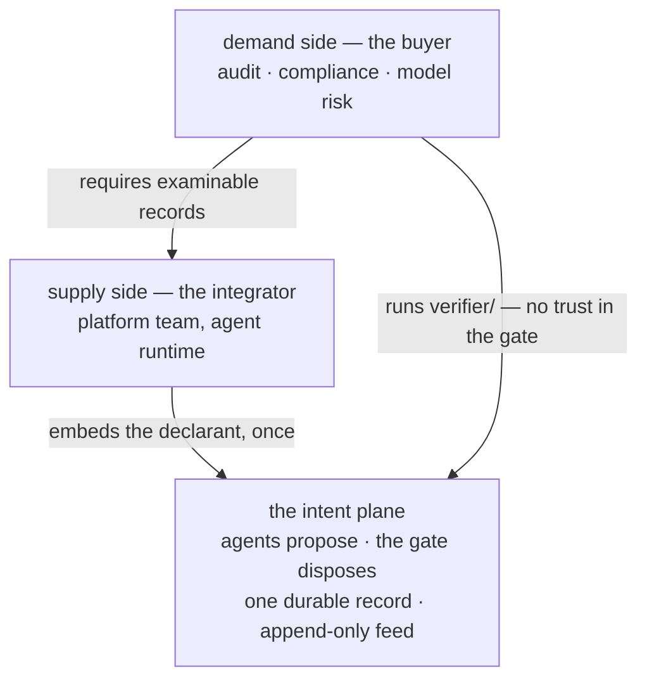
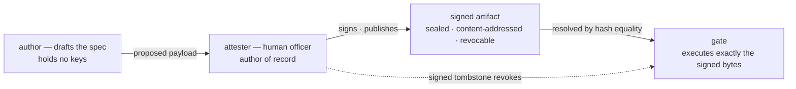
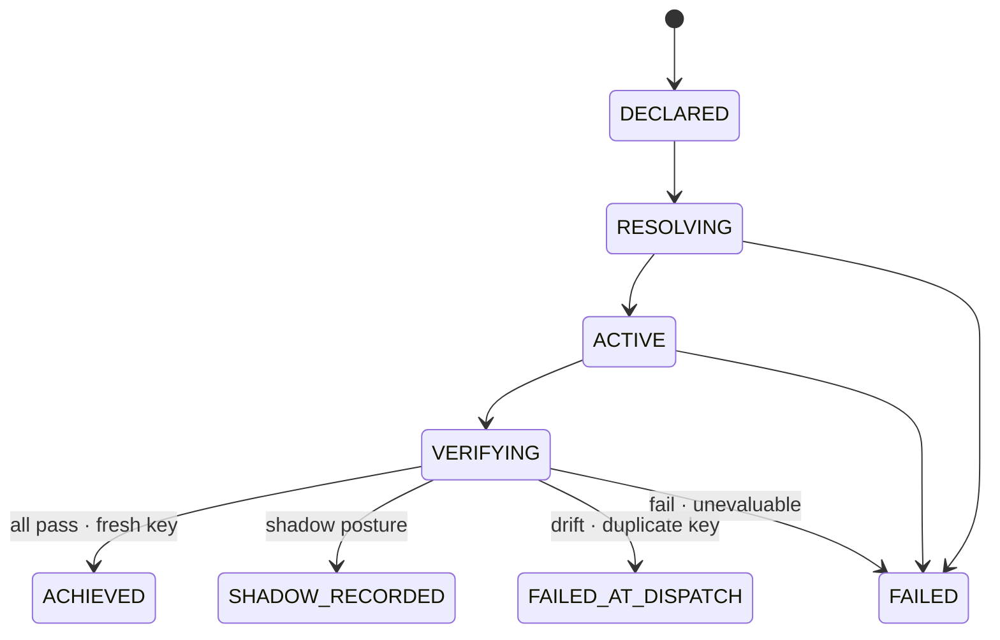

# intent-plane

**A fail-closed authorization gate for AI agents that take irreversible
actions — with an audit record third parties can re-verify without trusting
the gate.**

Before an agent moves money, files a report, or triggers a workflow, it must
**declare the intent**. A deterministic gate authorizes it against a policy
specification a human **signed** — or refuses. Every decision lands as
exactly one durable record, built to be independently recomputed later.

## Two sides, one record

This system is bought by one function and installed by another, and the repo
is laid out for both:

| | who | their question | their artifact |
|---|---|---|---|
| **demand side** | the accountability function — audit, compliance, model risk, a counterparty's diligence | "prove what your agents did, without asking us to trust your code" | **`verifier/`, ships here**: a Go package + CLI and a stdlib-only Python twin that re-derive every record from the feed alone — import-pinned to run none of the gate's code |
| **supply side** | the platform team wrapping the agent runtime ("how our agents call tools") | "one integration point, every agent inherits it" | the declarant seat: four wire routes + the feed cursor ([`docs/integration.md`](docs/integration.md)); a declarant SDK is the named next package and will be born in this repo |

The demand side *requires*; the supply side *satisfies the requirement* by
embedding once at the framework layer. What connects them is not a report
either side writes — it is the record itself, examinable by construction:



(The full system picture — settlement consumer, wire seams, where each
package sits — is drawn in [`docs/assurance.md`](docs/assurance.md).)

**What it refuses:** anything unevaluable. Missing data, an unsigned or
revoked spec, an empty criteria set, a duplicate action — all deny. The
worst case is an action that wrongly waits, never one that wrongly executes.

## Three commitments

1. **One signed object.** The bytes the attester signs are the bytes the
   gate executes — a hash equality, not an alignment of documents. Criteria
   cannot ride the wire at all; they reach the gate only through signature
   verification plus content-address equality.
2. **Authority is key possession.** The AI-facing drafting side (the author
   role) holds no keys and structurally cannot sign; nothing is enforceable
   until a human attester signs it, and a signed tombstone revokes it —
   maker-checker for what agents act on.
3. **Fail-closed, twice, with one record.** Verdicts are pass / fail /
   unevaluable — which never passes. Volatile facts and the authority itself
   are re-verified at the last moment before the consequence fires, and the
   decision and its audit record are one byte-exact event.

The authority chain behind commitments 1 and 2 — who may draft, who may
sign, what the gate will execute:



Details, the signed artifact, and the invariants: [`docs/architecture.md`](docs/architecture.md).

## The decision flow

```
DECLARED -> RESOLVING -> ACTIVE -> VERIFYING
         -> ACHIEVED | SHADOW_RECORDED | FAILED_AT_DISPATCH | FAILED
```

- **ACHIEVED** — one durable record; consumers settle from it.
- **SHADOW_RECORDED** — fully scored, durably recorded, not authorized.
- **FAILED_AT_DISPATCH** — a drifted fact, pulled spec, or duplicate key at
  the last moment before the consequence fires.
- **FAILED** — anything unevaluable, at any step: missing key, unattested /
  revoked / thin spec, unreachable scorer, failed criterion.

The state machine, exactly as the lifecycle table permits it (terminal
states have no outgoing edges; `FAILED_AT_DISPATCH` is reachable only from
`VERIFYING`):



(Refusals at the door — a missing key, an unattested, revoked, or thin
spec — answer `FAILED` synchronously at declaration; the scorer is never
consulted.)

Every branch fails closed. No `FAILED` or `FAILED_AT_DISPATCH` intent ever
leaves an `ACHIEVED` record in the feed — a refused or duplicate intent
means **no value moved**. And the terminal-position record of *every*
completed authorization — grant, shadow, or refusal — carries its
trajectory hash, so a trimmed or edited log is detectable by recomputation.
The decision flow with every guard, branch by branch, is drawn in
[`docs/architecture.md`](docs/architecture.md).

## Try it

```bash
go build ./... && go vet ./... && go test ./... -count=1   # the Go gate + verifier (add -race via WSL on Windows)
cd core/scorer && .venv/Scripts/python -m pytest           # the Python scorer
go test ./core/internal/contractcheck -count=1 -v          # the contract pins (boundary, vocabulary, neutrality)
go test ./verifier -count=1 -v                             # the Go verifier over the frozen feed fixtures
core/scorer/.venv/Scripts/python -m pytest verifier/pyverifier   # the Python twin, same bytes
```

Or take the demand side's seat directly — hand the CLI a feed and let it
re-derive everything:

```bash
go run ./verifier/cmd/intent-verify core/contract/feed/events-good.jsonl      # RESULT: VERIFIED, exit 0
go run ./verifier/cmd/intent-verify core/contract/feed/events-tampered.jsonl  # one flipped byte: REFUTED, exit 1
```

The one-command live demonstration — real gate, real scorer, a 9-probe
ladder from keygen through attestation, revocation, a scorer outage, and a
final recompute of the whole live feed by both verifier twins — lives with
the reference application in the **testing monorepo**:
[`treasury-intent-controller`](https://github.com/hossainpazooki/treasury-intent-controller)
(`treasury/quickstart.ps1` / `.sh` → `RESULT: 9/9 probes passed`).

## Layout

```
intent-plane/
├── CONTRACT.md      # the single current-state contract — the source of truth
├── core/            # the gate (Go, core/cmd/server + core/internal/…),
│                    #   the scorer (Python, core/scorer), wire + feed fixtures
├── plane/           # the signed artifact: envelope, spec store, resolver
│                    #   (verification ONLY — no signing seat in this repo)
├── verifier/        # the demand side's package: Go pkg + cmd/intent-verify +
│                    #   Python twin (pyverifier/); imports NOTHING from this
│                    #   module outside its own tree (§7.1)
└── docs/            # architecture · assurance · integration
```

This repo is the **published SDK**, and ownership runs per tree: the
consumer-facing packages (the verifier today; the declarant SDK when it
lands) are born and evolve **here** — the testing monorepo consumes them
back for its live probes. Plane internals (gate, scorer, `plane/`) are
experimented on in the testing monorepo and ported here once they settle.
The application seats (authority / control / authoring) and the live
demonstration stay in the monorepo.

## Read next

| If you are… | Read |
|---|---|
| the accountability function, deciding whether the records can be trusted | [`docs/assurance.md`](docs/assurance.md) — what is enforced & pinned vs test-grade vs staged, and what an audit firm can re-run |
| the platform team, embedding the gate in an agent runtime | [`docs/integration.md`](docs/integration.md) — the synchronous terminal, key discipline, feed consumption |
| going deep on the mechanism | [`docs/architecture.md`](docs/architecture.md) + [`CONTRACT.md`](CONTRACT.md) |

**Status, honestly:** the gate, scorer seam, signed-spec resolution, durable
feed, refusal-hash commitment, and the verifier twins are built and
test-pinned; key authority is test-grade until ADR-0009 (every signature
says so); workload identity and record signing are staged, not built — so
the verifier proves the record self-consistent, not never-rewritten. The
declarant SDK is planned, not built: today the supply side codes against
the wire. The full claim-by-claim standing — nothing here asks to be
believed — is in [`docs/assurance.md`](docs/assurance.md).
