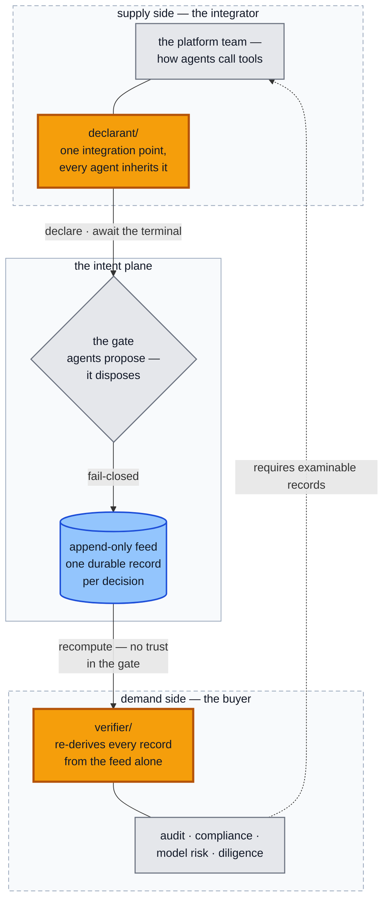
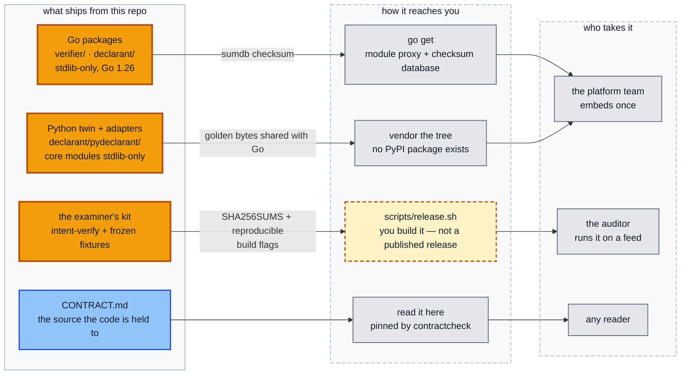
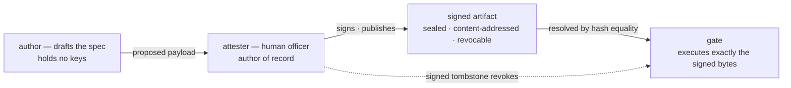
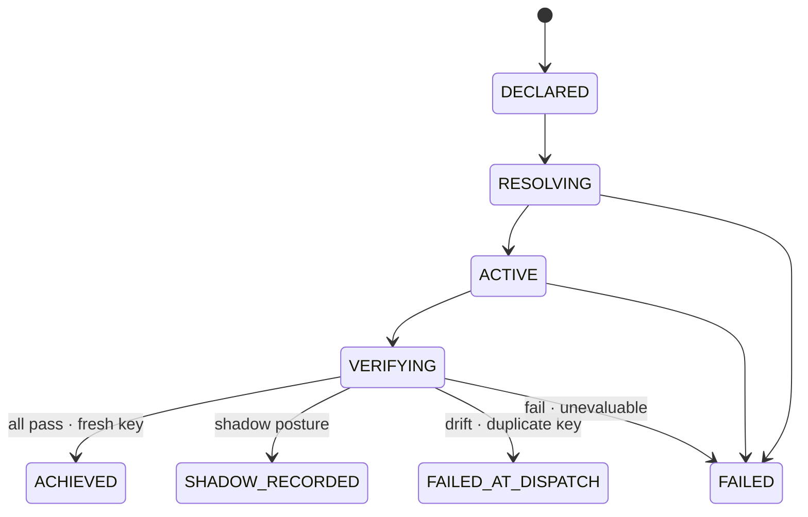

# intent-plane

**A fail-closed authorization gate for AI agents that take irreversible
actions — with an audit record third parties can re-verify without trusting
the gate.**

Before an agent moves money, files a report, or triggers a workflow, it must
**declare the intent**. A deterministic gate authorizes it against a policy
specification a human **signed** — or refuses. Every decision commits to a
durable record, built to be independently recomputed later.



Read it left to right. The platform team embeds the **amber `declarant/`
package** once, at the framework layer, and every agent inherits the gate.
The gate refuses anything it cannot evaluate and writes exactly one durable
record per decision into the **blue feed**. The accountability function —
audit, compliance, model risk, a counterparty's diligence — runs the **amber
`verifier/` package** over that feed and re-derives every decision without
running, or trusting, a line of the gate's code. Those two amber packages
are what this repo ships: one per side of the sale, meeting at the record.
The worst case, everywhere in this system, is an action that wrongly waits
— never one that wrongly executes.

## Gate the call, three ways

The gate sits at the tool-call seam, not in the prompt. Embed it once and
every agent inherits it:

```python
from client import Client
from langchain_adapter import gate_tool                    # needs langchain-core
from mcp_adapter import IntentGateMiddleware, gated_proxy  # needs fastmcp

client = Client("http://127.0.0.1:8080")     # bounded, 30s per call, by default

# (a) a LangChain tool — one call
gated = gate_tool(my_tool, client,
                  intent_spec_hash=SPEC_HASH, scope="per-actor", run_id=run_id)

# (b) an MCP server you OWN — attach the middleware
server.add_middleware(IntentGateMiddleware(
    client, intent_spec_hash=SPEC_HASH, scope="per-actor", run_id=run_id))

# (c) an MCP server you do NOT own — front it, unchanged
gated = gated_proxy(backend, client,
                    intent_spec_hash=SPEC_HASH, scope="per-actor", run_id=run_id)
```

The tool body runs **only** on a fresh synchronous `Proceed`. Everything
else — a failed criterion, an unsigned or revoked spec, a duplicate action,
an outage, an outcome outside the closed vocabulary — surfaces as a
classified refusal with the body never called. Path (c) is the one the
others cannot do: the fronted server never learns the gate exists, and a
refused call never reaches it at all — governance imposed by the operator,
with **no cooperation from the tool's owner**. Or skip the adapters and
speak the wire directly: the Go and Python declarant SDKs are the same
discipline as plain libraries ([`docs/integration.md`](docs/integration.md)).

## Two sides, one record

This system is bought by one function and installed by another, and the repo
is laid out for both:

| | who | their question | their artifact |
|---|---|---|---|
| **demand side** | the accountability function — audit, compliance, model risk, a counterparty's diligence | "prove what your agents did, without asking us to trust your code" | **`verifier/`**: a Go package + CLI and a stdlib-only Python twin that re-derive every record from the feed alone — import-pinned to run none of the gate's code |
| **supply side** | the platform team wrapping the agent runtime ("how our agents call tools") | "one integration point, every agent inherits it" | **`declarant/`**: exact wire marshal, derived idempotency keys, a total terminal classification, the 500-edge feed consult — plus the LangChain and MCP adapters above |

The demand side *requires*; the supply side *satisfies the requirement* by
embedding once. What connects them is not a report either side writes — it
is the record itself, examinable by construction. (The full system picture —
settlement consumer, wire seams, where each package sits — is drawn in
[`docs/assurance.md`](docs/assurance.md).)

## What it refuses

Fail-closed is a posture, and these are its teeth:

- **Anything unevaluable.** Missing data, an unsigned, revoked, or thin
  spec, an unreachable scorer — all deny. "Cannot evaluate" never collapses
  into a pass, and an empty criteria set refuses rather than vacuously
  granting.
- **Duplicates, however spelled.** The idempotency key is *derived* from
  the action's canonicalized identity, never remembered: an elided default
  and an explicit one, `500` and `500.0`, a nested object left empty and
  spelled out — one action, one key, and the repeat is refused with the
  consequence fired exactly once. That also makes replicas free: a retry
  landing on a different instance derives the same key and is refused just
  as correctly, with no shared state.
- **Calls it cannot key honestly.** An unreadable schema, an absent
  required argument, or (on the proxy path) an omitted property whose
  effective value no schema can reveal — refused *before* anything is
  declared, so the record never carries an authorization for a call that
  never ran.
- **Redirects.** Neither SDK client, nor the gate's own scorer call, ever
  follows a 3xx — a followed redirect silently swaps the origin and (for
  301/302/303) drops the request body, which would let an unrelated origin's
  200 read as authorization. A redirect is treated as what it is: not an
  answer.
- **The unknown.** Any outcome outside the contractually closed vocabulary
  classifies as `Unknown` and refuses. New cause classes amend the contract
  first.

Each of these is pinned by tests that were made to fail before the guard
existed — the claim-by-mechanism map is [`docs/assurance.md`](docs/assurance.md).

## Distribution

Four pieces ship from this repo, by four different routes, to two kinds of
reader. One route is "you build it yourself", and the diagram says so:



| piece | how you get it | integrity |
|---|---|---|
| **Go packages** — `verifier/`, `declarant/` | `go get github.com/hossainpazooki/intent-plane`. Public module, Go 1.26, **stdlib-only on the Go side** — no transitive dependency to review | the module proxy's checksum database |
| **Python twin + adapters** — `declarant/pydeclarant/` | **Vendored: copy the tree.** There is no PyPI package — packaging is not built. `declare.py`, `client.py`, `gating.py` are stdlib-only; the LangChain and MCP adapters are optional and need `langchain-core` / `fastmcp` respectively | the frozen golden request bytes both languages are held to |
| **The examiner's kit** — `intent-verify` + frozen fixtures | **Build it: `scripts/release.sh`.** Cross-compiles for linux/amd64, linux/arm64, darwin/arm64 and windows/amd64, and bundles the byte-frozen good/tampered feed pair with their expected reports ([`verifier/KIT.md`](verifier/KIT.md)) | `SHA256SUMS` in the kit, plus three load-bearing build flags (`-trimpath -buildvcs=false -ldflags=-buildid=`) so an auditor can rebuild and match |
| **The contract** — [`CONTRACT.md`](CONTRACT.md) | Read it here. It is the source the code is held to, not a summary written after the fact | the pins in `core/internal/contractcheck` |

Two things this section deliberately does not claim. The kit is **not
published as a release artifact** — `dist/` is gitignored and there is no
release automation, so today you build it and hand it to your auditor
yourself. And release integrity stops at **checksums, not signatures**:
signing releases is a decision that has not been taken, and saying so is
cheaper than implying a chain of custody this project does not have.

## Three commitments

1. **One signed object.** The bytes the attester signs are the bytes the
   gate executes — a hash equality, not an alignment of documents. Criteria
   cannot ride the wire at all; they reach the gate only through signature
   verification plus content-address equality.
2. **Authority is key possession.** The AI-facing drafting side (the author
   role) holds no keys and structurally cannot sign; nothing is enforceable
   until a human attester signs it, and a signed tombstone revokes it —
   maker-checker for what agents act on. (The signing seats live in the
   application built on this SDK; this repo ships the verification half.)
3. **Fail-closed, twice, with one record.** Verdicts are pass / fail /
   unevaluable — which never passes. Volatile facts and the authority itself
   are re-verified at the last moment before the consequence fires, and the
   decision and its audit record are one byte-exact event.

The authority chain behind commitments 1 and 2 — who may draft, who may
sign, what the gate will execute:



Details, the signed artifact, and the invariants: [`docs/architecture.md`](docs/architecture.md).

## The decision flow

```
DECLARED -> RESOLVING -> ACTIVE -> VERIFYING
         -> ACHIEVED | SHADOW_RECORDED | FAILED_AT_DISPATCH | FAILED
```

- **ACHIEVED** — one durable record; consumers settle from it.
- **SHADOW_RECORDED** — fully scored, durably recorded, not authorized.
- **FAILED_AT_DISPATCH** — a drifted fact, pulled spec, or duplicate key at
  the last moment before the consequence fires.
- **FAILED** — anything unevaluable, at any step: missing key, unattested /
  revoked / thin spec, unreachable scorer, failed criterion.

The state machine, exactly as the lifecycle table permits it (terminal
states have no outgoing edges; `FAILED_AT_DISPATCH` is reachable only from
`VERIFYING`):



(Refusals at the door — a missing key, an unattested, revoked, or thin
spec — answer `FAILED` synchronously at declaration; the scorer is never
consulted.)

Every branch fails closed. No `FAILED` or `FAILED_AT_DISPATCH` intent ever
leaves an `ACHIEVED` record in the feed — a refused or duplicate intent
means **no value moved**. And the terminal-position record of *every*
completed authorization — grant, shadow, or refusal — carries its
trajectory hash, so a trimmed or edited log is detectable by recomputation.
The decision flow with every guard, branch by branch, is drawn in
[`docs/architecture.md`](docs/architecture.md).

## Try it

```bash
go build ./... && go vet ./... && go test ./... -count=1   # the Go gate + consumer trees (add -race via WSL on Windows)
cd core/scorer && .venv/Scripts/python -m pytest           # the Python scorer
go test ./core/internal/contractcheck -count=1 -v          # the contract pins (boundary, vocabulary, neutrality)
go test ./verifier -count=1 -v                             # the Go verifier over the frozen feed fixtures
core/scorer/.venv/Scripts/python -m pytest verifier/pyverifier   # the Python twin, same bytes
go test ./declarant -count=1 -v                            # the declarant: golden bytes, classification, 500 edge
core/scorer/.venv/Scripts/python -m pytest declarant/pydeclarant  # the declarant's Python twin + the LangChain and MCP adapters (each adapter's tests skip visibly without its framework)
```

Or take the demand side's seat directly — hand the CLI a feed and let it
re-derive everything:

```bash
go run ./verifier/cmd/intent-verify core/contract/feed/events-good.jsonl      # RESULT: VERIFIED, exit 0
go run ./verifier/cmd/intent-verify core/contract/feed/events-tampered.jsonl  # one flipped byte: REFUTED, exit 1
```

There is also a one-command live demonstration — a real gate and scorer, a
14-probe ladder running keygen, attestation, revocation, declarations from
both SDK languages, a gated LangChain tool, a gated MCP server, a gated MCP
proxy fronting a server the operator does not own, a scorer outage, and a
final recompute of the whole live feed by both verifier twins. It lives with
the reference application in the maintainers' testing monorepo, which is
**private** — so, said plainly: a reader of this repo cannot run the live
ladder today. What you can run here is everything above — the full suite
including every byte-comparison and mutant pin — and the examiner's kit
against its frozen fixture pair ([`verifier/KIT.md`](verifier/KIT.md)).

## Layout

```
intent-plane/
├── CONTRACT.md      # the single current-state contract — the source of truth
├── core/            # the gate (Go, core/cmd/server + core/internal/…),
│                    #   the scorer (Python, core/scorer), wire + feed fixtures
├── plane/           # the signed artifact: envelope, spec store, resolver
│                    #   (verification ONLY — no signing seat in this repo)
├── verifier/        # the demand side's package: Go pkg + cmd/intent-verify +
│                    #   Python twin (pyverifier/); imports NOTHING from this
│                    #   module outside its own tree (§7.1)
├── declarant/       # the supply side's package: Go pkg + cmd/intent-declare +
│                    #   Python twin (pydeclarant/) with the LangChain and MCP
│                    #   adapters; force_scores exists in NO declarant type (§2.7)
└── docs/            # architecture · assurance · integration
```

This repo is the **published SDK**, and ownership runs per tree: the
consumer-facing packages (the verifier and the declarant) are born and
evolve **here** — the testing monorepo consumes them back for its live
probes. Plane internals (gate, scorer, `plane/`) are experimented on in the
testing monorepo and ported here once they settle. The application seats
(authority / control / authoring) and the live demonstration stay there.

## Read next

| If you are… | Read |
|---|---|
| the accountability function, deciding whether the records can be trusted | [`docs/assurance.md`](docs/assurance.md) — what is enforced & pinned vs test-grade vs staged, and what an audit firm can re-run |
| the platform team, embedding the gate in an agent runtime | [`docs/integration.md`](docs/integration.md) — the synchronous terminal, key discipline, the adapters, feed consumption |
| going deep on the mechanism | [`docs/architecture.md`](docs/architecture.md) + [`CONTRACT.md`](CONTRACT.md) |

**Status, honestly.** Built and test-pinned: the gate, the scorer seam,
signed-spec resolution, the durable feed, the refusal-hash commitment, the
verifier twins, and the declarant twins — Go and Python held to the same
golden wire bytes, with the LangChain and MCP adapters riding on top (each
optional; each skips visibly without its framework). Key authority is
test-grade until production key authority lands, and every signature says
so. Workload identity and record signing are staged, not built — so the
verifier proves the record *self-consistent*, not *never-rewritten*. The
claim-by-claim standing — nothing here asks to be believed — is in
[`docs/assurance.md`](docs/assurance.md).
