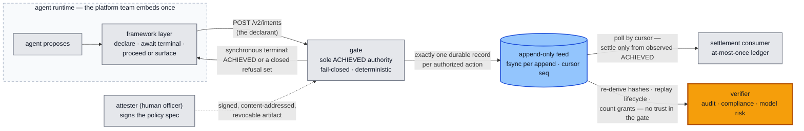
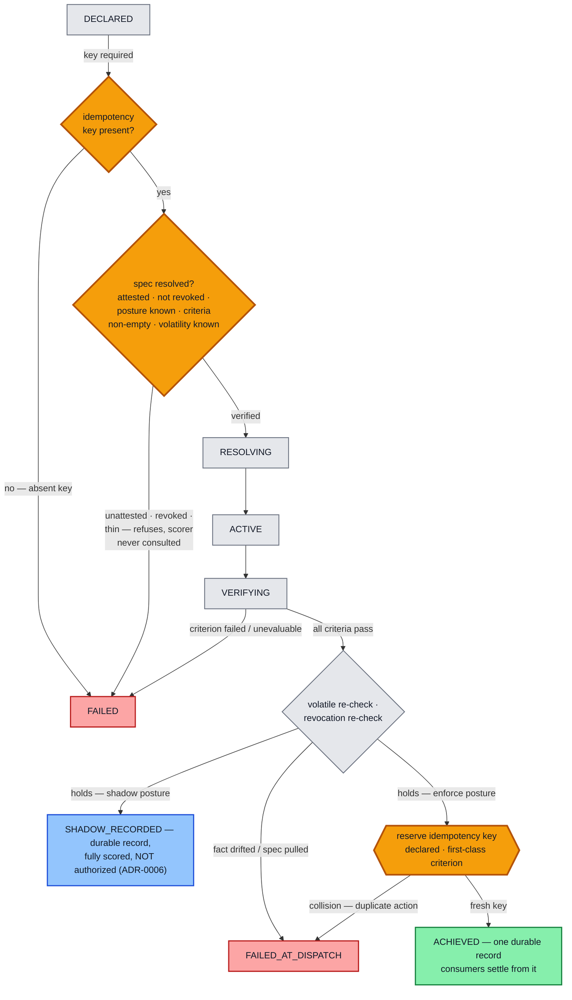

# intent-plane

**A fail-closed authorization gate for AI agents that take irreversible
actions — with an audit record third parties can re-verify without trusting
the gate.**

Before an agent moves money, files a report, or triggers a workflow, it must
**declare the intent**. A deterministic gate authorizes it against a policy
specification a human **signed** — or refuses. Every decision lands as
exactly one durable record, built to be independently recomputed later.

- **What ships here:** a Go authorization gate (stdlib only) + a Python
  criterion-scoring service + the contract (`CONTRACT.md`) + byte-frozen
  cross-language wire fixtures. This is the SDK — small, domain-agnostic,
  verification-only (it holds no signing keys, structurally).
- **Who it's for:** the platform team wrapping an agent runtime (embed once,
  every agent inherits it) — and the accountability function behind them
  (audit, compliance, model risk), who can re-derive every record from the
  feed with no trust in this code.
- **What it refuses:** anything unevaluable. Missing data, an unsigned or
  revoked spec, an empty criteria set, a duplicate action — all deny. The
  worst case is an action that wrongly waits, never one that wrongly
  executes.



## Three commitments

1. **One signed object.** The bytes the attester signs are the bytes the
   gate executes — a hash equality, not an alignment of documents. Criteria
   cannot ride the wire at all; they reach the gate only through signature
   verification plus content-address equality.
2. **Authority is key possession.** The AI-facing drafting side (the author
   role) holds no keys and structurally cannot sign; nothing is enforceable
   until a human attester signs it, and a signed tombstone revokes it —
   maker-checker for what agents act on.
3. **Fail-closed, twice, with one record.** Verdicts are pass / fail /
   unevaluable — which never passes. Volatile facts and the authority itself
   are re-verified at the last moment before the consequence fires, and the
   decision and its audit record are one byte-exact event.

Details, the signed artifact, and the invariants: [`docs/architecture.md`](docs/architecture.md).

## The decision flow



No `FAILED` or `FAILED_AT_DISPATCH` intent ever leaves an `ACHIEVED` record
in the feed — a refused or duplicate intent means **no value moved**.

## Try it

```bash
go build ./... && go vet ./... && go test ./... -count=1   # the Go gate (add -race via WSL on Windows)
cd core/scorer && .venv/Scripts/python -m pytest           # the Python scorer
go test ./core/internal/contractcheck -count=1 -v          # the contract pins (boundary, vocabulary, neutrality)
```

The one-command live demonstration — real gate, real scorer, an 8-probe
ladder from keygen through attestation, revocation, and a scorer outage —
lives with the reference application in the **testing monorepo**:
[`treasury-intent-controller`](https://github.com/hossainpazooki/treasury-intent-controller)
(`treasury/quickstart.ps1` / `.sh` → `RESULT: 8/8 probes passed`).

## Layout

```
intent-plane/
├── CONTRACT.md      # the single current-state contract — the source of truth
├── core/            # the gate (Go, core/cmd/server + core/internal/…),
│                    #   the scorer (Python, core/scorer), wire fixtures
├── plane/           # the signed artifact: envelope, spec store, resolver
│                    #   (verification ONLY — no signing seat in this repo)
└── docs/            # architecture · assurance · integration
```

This repo is the **published SDK**; experimentation, the application seats
(authority / control / authoring), and the demonstration live in the testing
monorepo and are ported here once they settle.

## Read next

| If you are… | Read |
|---|---|
| deciding whether the records can be trusted | [`docs/assurance.md`](docs/assurance.md) — what is enforced & pinned vs test-grade vs staged, and what an audit firm can re-run |
| embedding the gate in an agent runtime | [`docs/integration.md`](docs/integration.md) — the synchronous terminal, key discipline, feed consumption |
| going deep on the mechanism | [`docs/architecture.md`](docs/architecture.md) + [`CONTRACT.md`](CONTRACT.md) |

**Status, honestly:** the gate, scorer seam, signed-spec resolution, and
durable feed are built and test-pinned; key authority is test-grade until
ADR-0009 (every signature says so); workload identity and record signing are
staged, not built. The full claim-by-claim standing — nothing here asks to be
believed — is in [`docs/assurance.md`](docs/assurance.md).
