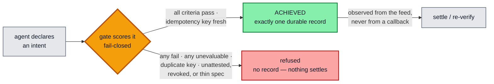
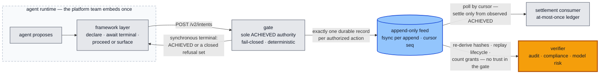
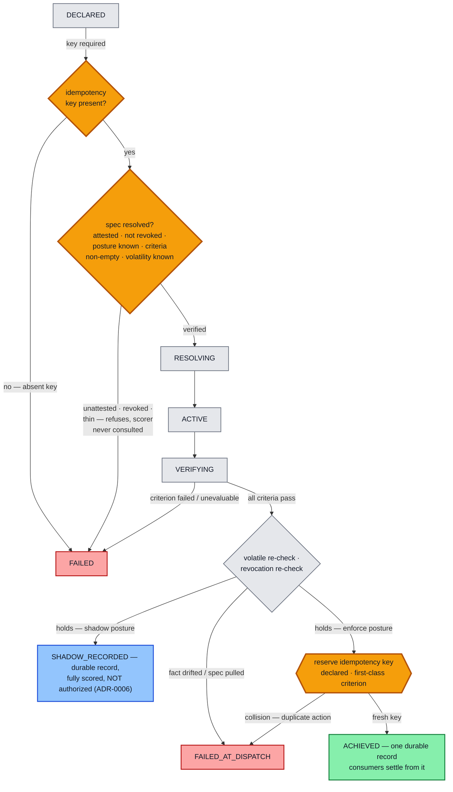
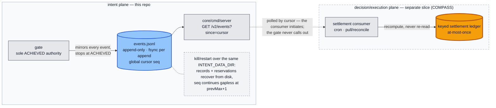

# intent-plane

**An authorization layer for the moment an agent's well-formed answer is
wrong — and the record of who signed.**

The problem is no longer bad output; it is plausible output with irreversible
consequences. Once an agent can move money, file a report, or trigger a
workflow, the governing question becomes structural: what happens,
mechanically, when the model is wrong — and can you prove afterward who
authorized what it did? This repo is the reference SDK for that question:
agents propose, the plane's gate disposes — a deterministic core that decides
whether a declared intent is authorized, holds the sole authority to emit
`ACHIEVED` (written exactly once to a durable append-only feed), and never
lets *unevaluable* collapse into a pass.



## Three commitments, each mechanical rather than procedural

**1 · One signed object.** Governance, control, and enforcement bind to a
single content-addressed, signed specification: the bytes an officer attests
are the bytes the gate executes — equality of cryptographic hashes, not
alignment of three documents. The wire carries **no criteria** (the field
does not exist in the request DTO; the old shape gets a loud 400). The
**declarant** — the caller declaring the intent — supplies the spec's content
address plus the idempotency key and scope; criteria, action class, and
enforcement posture reach the gate ONLY through `CONTRACT.md` §2.6
resolution: an envelope signed by the **attester**, verified against the
trust root, its payload hashing byte-for-byte to the claimed address.

**2 · Authority is key possession.** The drafting side (the **author** role)
holds no keys and cannot sign, publish, or activate anything; nothing becomes
enforceable until a designated attester signs it — maker-checker discipline
applied to what automated agents act on. Attested artifacts are sealed and
revocable: a signed tombstone withdraws authority, the withdrawal is itself
part of the record, and a tombstone signed by any other key does not revoke.
This SDK's half of the claim is structural: **no signing seat exists anywhere
in this repo** — the core is verification-only and imports no application
package. The deployment half (workload identity) is staged, not built — see
the claim map.

**3 · Fail-closed, twice, with one record.** Every declared intent is scored
pass / fail / unevaluable — which never passes. Missing data denies; volatile
checks are re-verified at the last moment before the consequence fires, and
so is the authority itself (a spec revoked mid-flight stops at the edge). The
authorization and its audit record are one byte-exact event: the record
cannot disagree with the decision, and the decision cannot exist without the
record. The worst case of a drafting error or a data outage is an action that
wrongly waits — never one that wrongly executes.

## Who this is for

**If you answer for agent actions after the fact** — audit, compliance,
model risk, a counterparty's diligence — this system was built for your
examination, not just its own operation. Read its cost structure as a
revealed preference: per-intent logical clocks with no wallclock, a JSON-free
length-prefixed hash encoding, byte-frozen cross-language fixtures, a durable
fsync before every success, exactly one authorization record per key — none
of it buys anything at decision time. It pays off in exactly one scenario:
when someone who does **not** trust the gate re-derives the record afterward.

**If you own how your agents call tools** — the platform team wrapping an
agent runtime — you embed the gate once at the framework layer and every
agent inherits it. The demand side is the accountability function; the supply
side is your integration. Neither half sells alone.



## The lifecycle — unevaluable never passes, and a stale pass cannot authorize

What makes two actions "the same action" is a **declared idempotency key,
treated as a first-class gate criterion** — not adapter-local dedup logic.
The key is required (an absent key is unevaluable and fails closed) and is
reserved at the dispatch edge; a near-duplicate — same key, one changed
field, hence a *different* intent hash — collides on the key and is refused.
At-most-once holds on the settlement log by construction, not by assertion.
The key's governance as a signed, expert-attested criterion lives in the
attested spec payload (`CONTRACT.md` §2.6, per ADR-0007) — this gate consumes
and enforces it.



Both `FAILED` and `FAILED_AT_DISPATCH` guarantee **no `ACHIEVED` record
exists** in the durable feed — so no consumer ever settles. The audit reading
is unambiguous: a duplicate or drifted intent ⟹ **no value moved**.

## What the record proves, by stage

The claim grows with the mechanism, and each stage is separable in review:

| Stage | What the record proves | Standing |
|---|---|---|
| Today, from the feed alone | This record is self-consistent and its hashes recompute — in your language, not ours. (Precisely: `ACHIEVED` records carry their trajectory hash for matching; refusal terminals are recompute-only today — committing refusal hashes to the feed is an open decision row, not yet built.) | available now |
| + signed specifications | The gate executed the signed specification: criteria cannot arrive except through signature verification and content-address equality. | enforced (test key authority) |
| + record signing | This record was not rewritten: the feed itself becomes tamper-evident. | staged (R1) |
| + workload identity | This gate, and only this gate, produced it: sole-writer as a deployment fact. | staged (R2) |

## What an audit firm can re-run, without trusting the gate

From a decision record plus the feed (`GET /v2/events?since=`), in the
reviewer's own language with no vendor code: recompute the trajectory hash of
an authorization from its event records (the hash path never touches JSON,
which is what makes cross-language recomputation exact rather than
approximate); replay the lifecycle as a walk of the closed transition graph,
every refusal reason drawn from a closed, pinned vocabulary; prove
at-most-once — exactly one authorization record per idempotency key across
the entire feed, sequence numbers gap-free; bind records to declarations via
the deterministic intent identity; and check the witnesses — which scoring
authority answered (`scorer_id`), which key attested the specification.

**Stated honestly:** the ~200-line independent verifier is a design target
this encoding was built for, **not a shipped package** — the reference
Go+Python verifier twins and a golden feed fixture (frozen `events.jsonl`
plus expected hashes and verdicts) are recorded future work. An independent
implementation must mind the traps the fixture will pin: length prefixes are
**byte** lengths (not code points), `scorer_id` and the global `seq` are
**hash-exempt** feed fields, and the store tolerates CRLF and a torn trailing
line. Verdicts should be tri-state like the gate itself — verified, refuted,
unverifiable — and unverifiable never passes.

## What a platform team embeds

Declaration is one synchronous request that returns the terminal — no
asynchronous state machine to build. Refusal reasons form a contractually
closed set (`CONTRACT.md` §3.3 — adding a cause amends the table first), so
the framework switches on stable strings and version skew fails loudly
(`DisallowUnknownFields`). The two disciplines the framework owns: derive the
idempotency key deterministically from the action's identity (never a fresh
UUID per attempt — that deletes the exactly-once property; never too coarse —
reservations are permanent), and settle side effects only from observed
`ACHIEVED` records in the durable feed, treating the synchronous response as
UX. A collision means the action already happened: reconcile from the
record, never mint a new key to get past it.



## Claim-to-mechanism map

Every load-bearing claim above, with its current standing. **enforced &
pinned** = a failing test refutes the claim; **built · test-grade** = the
mechanism runs, with a named production blocker; **staged · asserted** =
recorded intent, not demonstrated. The separation is deliberate: nothing
below asks to be believed. (P-numbers are the premise clauses from the
intent-plane spec; normative role vocabulary — declarant / author / attester
/ gate — is `CONTRACT.md` §1.)

| Claim | Status | Mechanism / boundary |
|---|---|---|
| One signed object — attested bytes are executed bytes (P1) | **enforced & pinned** (test key authority) | The wire has NO criteria field (`core/cmd/server/main.go` `specDTO`; the old shape 400s). Criteria reach the gate only through §2.6 resolution: ed25519 envelope verification + content-address equality (`plane/store.go` `Resolve`); an unattested hash refuses before any scoring (`TestUnattestedSpecRefuses`); a single flipped payload byte refuses verification (`TestTamperedPayloadRefuses`). |
| Artifacts are the only crossings (P2) | enforced gate-side | Four routes only (`newMux`) + the durable feed; the core package set and import adjacency pinned mechanically (`TestImportBoundary`). |
| Authority is key possession — the drafting side cannot sign (P3) | **code graph enforced · deployment graph staged** | This repo contains no signing seat at all: the core is verification-only and imports no application package (`TestImportBoundary`). Applications bring their own seats under a name-free rule: any `<tree>/authority` is importable only from `<tree>/control` (`TestKeyPossessionBoundary`). stdlib crypto stays reachable by any Go code, so "cannot sign at all" is the DEPLOYMENT half (workload identity, R2) — asserted, not demonstrated. |
| Sealed, revocable artifact; the attester is author of record | **enforced & pinned** | Attestation seals the payload under the attester's key (keyid witnessed in resolution). Revocation is a signed tombstone; a forged tombstone does not revoke (`TestForgedTombstoneDoesNotRevoke`); revocation is checked at declaration AND re-checked at the dispatch edge, with the tombstone's reason carried into the refusal (`TestRevokedResolutionWinsOverUnattested`). |
| Tri-state verdicts; unevaluable never passes (P4) | **enforced & pinned** | Closed scoring domain; every transport/decode/non-2xx error ⇒ `Unevaluable` (`core/internal/scoring/scorer.go`). The zero-configuration deployment authorizes nothing: no trust root ⇒ every spec unattested; no scorer ⇒ every criterion unevaluable. |
| Last-moment re-verification of stale checks | **enforced & pinned** | Volatile criteria re-scored at the dispatch edge; any non-pass stops with the distinct `FAILED_AT_DISPATCH` terminal naming where the error entered. Authority gets the same treatment (revocation re-check). |
| One byte-exact event — record and decision inseparable (P5) | **enforced & pinned** | The `ACHIEVED` event and its durable record are one emit; replay from the same inputs is byte-identical (`TestDeterminismReplay`). Every SCORED/RECHECK record carries a `scorer_id` witness, so a test-forced decision is never byte-indistinguishable from a live one — and `force_scores` itself is guarded (`INTENT_UNSAFE_FORCE_SCORES=1` at boot, else a loud 400). |
| Standard signing envelopes, independently verifiable | built · test-grade | DSSE-shaped envelopes (PAE v1, ed25519) verifiable by standard tooling. Key authority is test-grade and every signature says so (`key_authority: "test"`); production key management (ADR-0009 / R1) is the named blocker before this row reads "enforced". |
| Role separation enforced by workload identity | staged · asserted | Not built. Today's separation is the code-graph fact above (R2). |
| Logs index, gates decide | record authority built · trace export staged | The durable feed is the sole authority and the exportable index (cursor reads, per-intent replay). Push-based OTel emission is staged (R4), permitted only if trivially additive. |
| Staged rollout, itself signed — shadow until promoted | built · test-grade | Enforcement posture lives inside the signed payload; shadow runs are fully scored and durably recorded but authorize nothing and reserve nothing (`SHADOW_RECORDED`). Promotion is a fresh attestation producing a new hash — an authority act, never a config toggle. The governance decision recording this terminal (ADR-0006) is Proposed, not ratified. |
| Judgment routed to humans; abstention is the system working (P6) | gate-side **enforced & pinned** · chassis application-side | `Unevaluable` is a first-class score, and an unresolved `human_judgment` entry refuses (`unevaluable:human-judgment:<name>`, `TestHumanJudgmentRefuses`) — an invented number cannot replace a human decision. The authoring chassis that routes obligations into those entries is application-side (reference: the testing monorepo) and its guarantees are not yet test-backed there; the drafting intelligence that fills the seat is future work. |
| Thin-spec defense — attestation does not launder vacuity (P7) | **enforced & pinned** | Zero criteria ⇒ `FAILED unevaluable:empty-criteria`; unknown volatility ⇒ `FAILED unevaluable:invalid-volatility:<name>` — both refuse BEFORE any scoring (`TestFailClosedEmptyCriteria`, `TestFailClosedInvalidVolatility`); "no criterion failed" is never satisfied by "no criterion existed". |

Known production-posture gaps, recorded rather than hidden (`docs/ROADMAP.md`
in the testing monorepo): `force_scores` is guarded and witnessed but remains
a total scoring bypass wherever the boot flag is set; key authority is
test-grade until ADR-0009; workload identity (R2) is asserted; the feed read
surface is unauthenticated by design (network isolation is a deployment
decision); refusal terminals do not yet commit their trajectory hash to the
feed; with more than one key in a trust root, revocation authority is flat
(any root key revokes any spec) — a who-may-revoke theory is ADR-0009 scope.

## The artifact, precisely

- **Envelope.** DSSE-shaped JSON: `payloadType`, base64 `payload`,
  `signatures` (`keyid` = 16-hex sha256 prefix of the public key; ed25519
  over the v1 pre-authentication encoding; a `key_authority` stamp on every
  signature). Spec payloads and revocation tombstones are the same envelope
  with different payload types.
- **Content address.** The intent-spec hash is sha256 over the raw payload
  bytes inside the envelope. A declaration cites the hash; nothing else on
  the wire can carry policy content.
- **Spec payload.** Strict-decoded: version, action class, enforcement
  posture (`enforce` | `shadow`), criteria (name / threshold / volatility),
  source pins (sha256 of the exact policy passage behind each value), named
  unknowns, and human-judgment entries. Unknown fields refuse. (Thresholds
  are float64 today; the payload schema moves to exact decimal strings
  before R1 — a binding trigger recorded in ADR-0007, because migrating
  content-addressed signed bytes later means re-attesting everything.)
- **Resolution (hybrid rule).** The store is authoritative: a published,
  pinned envelope resolves; a wire-supplied envelope resolves only if it
  verifies against the same trust root, hashes to the claimed address, and
  that address is pinned in the store. Everything else is unattested and
  refuses before scoring. A verified tombstone wins over every other outcome.
- **Terminals.** `ACHIEVED` (one byte-exact record), `FAILED` at scoring,
  `FAILED_AT_DISPATCH` at the edge (volatile drift, idempotency collision,
  or revocation — the cause class names where the error entered), and
  `SHADOW_RECORDED` (fully scored, durably recorded, authorizes nothing,
  reserves nothing).
- **Refusal causes are a closed set.** Absent key, unattested spec, invalid
  posture, unresolved human judgment, empty criteria, invalid volatility,
  revoked-with-reason. Adding a cause is a contract amendment, not a code
  change.

## Invariants (enforced by construction, pinned by tests)

1. The gate is the **sole emitter** of the single `ACHIEVED` record, fsynced to the
   durable feed before success; consumers act only after observing it.
2. **Tri-state, fail-closed** scoring: any `Fail` or `Unevaluable` ⟹ not authorized.
3. **Stable vs volatile**: stable criteria scored once (declaration); volatile scored
   at declaration *and* re-verified at the dispatch edge by the same authority.
4. **Idempotency by construction**: key required; reserved at the dispatch edge; a
   near-duplicate (same key, different intent hash) collides ⟹ `FAILED_AT_DISPATCH`,
   at-most-once on the settlement log.
5. **Determinism / replay**: per-intent logical clock, IDs from the episode seed, no
   wallclock; replay drives **recompute** (not a re-read). The feed's global cursor
   (`seq`) never enters the per-intent trajectory hash.
6. **Durability**: the event feed and the idempotency reservations survive process
   restart over the same `INTENT_DATA_DIR` (kill/restart proven — byte-identical
   events, same-key re-dispatch still refused).
7. **Thin-spec defense** (step 1b): zero criteria ⟹ `FAILED`
   `unevaluable:empty-criteria`; unknown volatility ⟹ `FAILED`
   `unevaluable:invalid-volatility:<name>`. Both refuse **before any scoring** —
   the scorer is never consulted.
8. **Core neutrality, pinned mechanically**: `core/` carries no domain
   vocabulary (`TestCoreNeutrality`), alongside the pinned import boundary and
   role vocabulary — amend `CONTRACT.md` first, then the pinned tables, never
   the reverse.

## What a reviewer can re-run — and where

**In this repo:** the import-boundary gate pins the core package graph and
the name-free key-possession rule; the determinism gate replays a full
lifecycle and byte-compares the records; the tamper gate flips one payload
byte and watches verification refuse; the contractcheck six (boundary,
key-possession, neutrality, vocabulary presence, forbidden nouns, retired
noun) run inside the named gate below.

**In the testing monorepo** (`github.com/hossainpazooki/treasury-intent-controller`):
the end-to-end probe ladder runs the whole plane — keygen, attest, publish,
authorize against a signed spec, collide on idempotency, refuse an unattested
hash, revoke and watch the reason surface, kill the scorer and watch the
system deny — in one command, self-asserting, against the live scoring
service (`treasury/quickstart.ps1` / `.sh`, expected final line
`RESULT: 8/8 probes passed`). That repo is the workbench: the application
seats (authority / control / authoring), the demonstration deployment, and
experimentation live there; settled core changes are ported here. The two
repos share the module path by design.

## Project structure

```
intent-plane/
├── CONTRACT.md            # the single current-state contract (§1–§10)
├── core/                  # the plane itself — carries no domain vocabulary
│   │                      #   (mechanically gated: TestCoreNeutrality)
│   ├── cmd/server/        # HTTP shell — the 4 routes, INTENT_* env
│   ├── internal/          # gate · lifecycle · audit · durable feed · scoring ·
│   │                      #   idempotency · contractcheck (test-only pins)
│   ├── scorer/            # Python resolver+scorer service — SCORER_* env
│   └── contract/scorer/   # golden wire fixtures — byte-frozen, cross-language
└── plane/                 # the signed artifact: envelope, spec payload, store,
                           #   resolver (verification ONLY — the SDK holds no keys)
```

| Path | Responsibility |
|---|---|
| `core/internal/lifecycle` | states + the `validTransitions` graph |
| `core/internal/intent` | intent / criterion / spec-param data types |
| `core/internal/audit` | append-only event log + trajectory hash |
| `core/internal/durable` | durable JSONL event feed: `GlobalSeq`, fsync-per-append, restart recovery |
| `core/internal/scoring` | `Scorer` interface, `HTTPScorer` (`/ml/evaluate`), test `FakeScorer` |
| `core/internal/adapter` | **test-only** reference settlement consumer (recompute path in replay tests) |
| `core/internal/idempotency` | dispatch-edge key reservation store (in-memory + durable file-backed) |
| `core/internal/gate` | the authorization engine + the acceptance suite pinning the `CONTRACT.md` §5 invariants |
| `core/internal/contractcheck` | test-only: pins the import-graph boundary (§7), the role vocabulary (§1), and core neutrality (§5.1 invariant 8; the fixture exemption lives in §9) per `CONTRACT.md` |
| `core/cmd/server` | HTTP shell: `POST /v2/intents`, `GET /v2/events`, `GET /v2/intents/{id}/events`, `GET /healthz`; state under `INTENT_DATA_DIR`; live scorer from `INTENT_SCORER_URL` (unset = refuse everything) |
| `core/scorer/` | the Python resolver+scorer service (`POST /ml/evaluate`, FastAPI) — see `core/scorer/README.md` |
| `core/contract/scorer/` | golden wire fixtures — the byte-level seam both sides test against |
| `plane/` | the signed artifact: DSSE-shaped envelope, spec payload, content-addressed store, hybrid resolver, revocation tombstones — verification only; with `core/`, this is the whole SDK |

`CONTRACT.md` is the single current-state contract — roles, wire, lifecycle,
algorithm, invariants, boundary, scorer seam, fixtures (consolidated
2026-08-03; the prior amendment chain lives in git history).

## Build & test

```bash
go build ./...
go vet ./...
go test ./... -count=1
go test ./... -count=1 -race   # needs cgo; on a Windows host without a C compiler, run via WSL
```

The Python scorer has its own gate (see `core/scorer/README.md`):

```bash
cd core/scorer && .venv/Scripts/python -m pytest   # unit + service matrix + wire fixtures
```

The live two-process smoke gate (real gate + real scorer, 8-probe ladder)
lives with the reference application in the testing monorepo; run it there
when a change touches the wire.

## Status

**Built and verified** — the durable emit-and-observe gate, the live scoring
seam, and the signed-spec resolution path. The gate stops at appending
`ACHIEVED`; settlement happens only in a consumer observing the durable feed
(test-only reference consumer in-repo). The criterion scorer
(`/ml/evaluate`) is live end-to-end: `core/cmd/server` selects the shared
`HTTPScorer` from `INTENT_SCORER_URL` (zero-config refuses everything), and
the Python service in `core/scorer/` answers it per `CONTRACT.md` §8,
verified two-process with a real service kill. This repo is the **intent
plane SDK** — gate, scorer, contract, and wire fixtures; the reference
application and its demonstration live in the testing monorepo
(`treasury-intent-controller`), where experimentation happens before changes
are ported here. Still separate: the settlement consumer
(COMPASS/TypeScript) and the wheel-backed artifact reader inside
`core/scorer/` (`ke-artifact-py` — built and live-verified 2026-07-12, but
Linux/CI-only: its test lane skips visibly on hosts without the wheel); the
ATLAS `IntentSpec` artifact type is merged upstream (ADR-0021, canon-5) but
is RETIRED as a criteria source (ADR-0007): criteria reach this gate only
through §2.6 spec resolution; `rule_artifact_hash` keeps pointing at the
upstream rule artifact as provenance.
