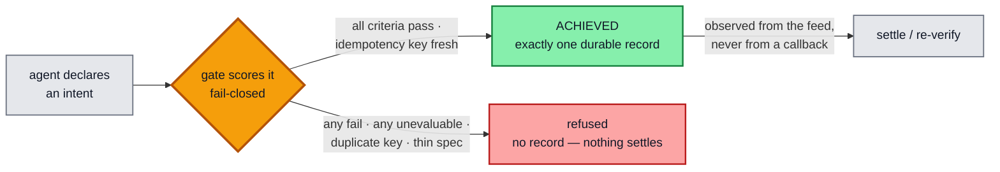
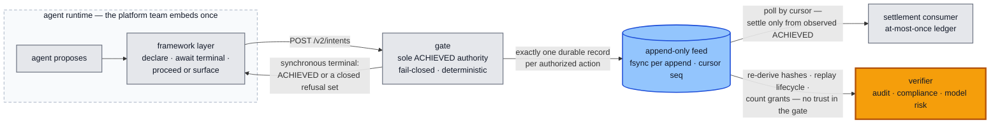
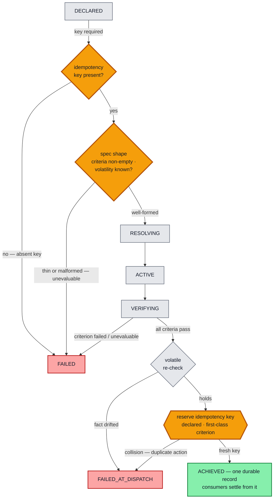
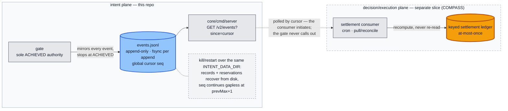

# intent-plane

A domain-agnostic authorization layer for agentic deployments. Agents propose;
the plane's gate disposes — a deterministic core that decides whether a
declared intent is authorized, holds the sole authority to emit `ACHIEVED`
(written exactly once to a durable append-only feed), and never lets
*unevaluable* collapse into a pass. Nothing crosses the plane until the gate
says so — and everything the gate decides is recorded to be **re-derived
later by someone who does not trust it**.



**If you answer for agent actions after the fact** — audit, compliance, model
risk, a counterparty's diligence — this repo was built for your examination,
not just its own operation. Every decision leaves a record designed for
independent recomputation: a per-intent event log on a logical clock (no
wallclock anywhere), a trajectory hash over a length-prefixed byte encoding
with **no JSON canonicalization to argue about**, exactly one durable
`ACHIEVED` record per authorized action, and byte-frozen wire fixtures that
pin the cross-language seam. From the feed alone (`GET /v2/events?since=`)
you can re-derive the hashes, replay the lifecycle against the closed
transition graph, and count the grants — in your own language, against your
own copy, with no call into this code. Stated honestly: today that proves a
record is *self-consistent and its hashes recompute*; what it cannot yet
prove is listed below rather than hidden (the premise table's
**asserted, not enforced** rows, and `docs/ROADMAP.md`).

**If you own how your agents call tools** — the platform team wrapping an
agent runtime — you embed the gate once at the framework layer and every
agent inherits it: declare the intent, await the terminal (the synchronous
`POST /v2/intents` response *is* the terminal — no polling state machine to
build), proceed on `ACHIEVED` or surface the refusal. Refusal reasons are a
**closed, machine-parseable set** pinned by contract (`CONTRACT.md` §3.3 —
new cause classes must amend the table first), so the integration is a switch
over stable strings; settlement and observability come from polling the
durable feed by cursor, never from trusting the synchronous response.



The gate reads no artifacts — criteria, thresholds, and the idempotency key arrive as
params from the **declarant** (the caller declaring the intent; the roles of the plane
are declarant / author / attester / gate, per `CONTRACT.md` §1). Scoring is
fail-closed: any `Fail` or `Unevaluable` denies authorization, and `Unevaluable` never
collapses into a pass — and the refusal is *shape-deep*: a spec with **zero criteria**
or an **unknown volatility** refuses at resolution (`unevaluable:empty-criteria`,
`unevaluable:invalid-volatility:<name>`) instead of vacuously granting, so "no
criterion failed" is never satisfied by "no criterion existed". Volatile facts
are re-checked at the dispatch edge by the same authority, immediately before
authorizing.

### The distinctive feature — exactly-once *by construction*

What makes two actions "the same action" is a **declared idempotency key, treated as
a first-class gate criterion** — not adapter-local dedup logic. The key is **required**
(an absent key is unevaluable and fails closed) and is **reserved at the dispatch edge**.
A near-duplicate — same key, one changed field, hence a *different* intent hash —
**collides on the key and is refused** (`FAILED_AT_DISPATCH`). So at-most-once holds on
the settlement log by construction, not by assertion. The amber nodes below are the
gate's checkpoints — the two idempotency checks flanking the spec-shape
check; the key's governance as a signed, expert-attested criterion
lives in the upstream ATLAS `IntentSpec` artifact — this gate consumes and
enforces it.



Both `FAILED` and `FAILED_AT_DISPATCH` guarantee **no `ACHIEVED` record exists** in the
durable feed — so no consumer ever settles. The audit reading is unambiguous: a
duplicate or drifted intent ⟹ **no value moved**.

## Invariants (enforced by construction, pinned by tests)

1. The gate is the **sole emitter** of the single `ACHIEVED` record, fsynced to the
   durable feed before success; consumers act only after observing it.
2. **Tri-state, fail-closed** scoring: any `Fail` or `Unevaluable` ⟹ not authorized.
3. **Stable vs volatile**: stable criteria scored once (declaration); volatile scored
   at declaration *and* re-verified at the dispatch edge by the same authority.
4. **Idempotency by construction**: key required; reserved at the dispatch edge; a
   near-duplicate (same key, different intent hash) collides ⟹ `FAILED_AT_DISPATCH`,
   at-most-once on the settlement log.
5. **Determinism / replay**: per-intent logical clock, IDs from the episode seed, no
   wallclock; replay drives **recompute** (not a re-read). The feed's global cursor
   (`seq`) never enters the per-intent trajectory hash.
6. **Durability**: the event feed and the idempotency reservations survive process
   restart over the same `INTENT_DATA_DIR` (kill/restart proven — byte-identical
   events, same-key re-dispatch still refused).
7. **Thin-spec defense** (step 1b): zero criteria ⟹ `FAILED`
   `unevaluable:empty-criteria`; unknown volatility ⟹ `FAILED`
   `unevaluable:invalid-volatility:<name>`. Both refuse **before any scoring** —
   the scorer is never consulted.
8. **Core neutrality, pinned mechanically**: `core/` carries no domain
   vocabulary (`TestCoreNeutrality`), alongside the pinned import boundary and
   role vocabulary — amend `CONTRACT.md` first, then the pinned tables, never
   the reverse.

## Emit-and-observe

The gate's job ends at the durable `ACHIEVED` record. Settlement belongs to a
consumer that **pulls** the feed by cursor and recomputes — the gate never calls
out, and a crash on either side loses nothing:



The amber ledger is the consumer-side twin of the amber checkpoints above: the
same declared key that gates dispatch keys the settlement ledger, so at-most-once
holds end to end.

## The premise, mapped to code (clause → enforcement)

The plane's premise clauses (P1–P7, from the intent-plane spec; normative role
vocabulary in `CONTRACT.md` §1) with the code that enforces each —
and an honest list of what is **asserted, not enforced**. Line numbers are as
of the 2026-08-03 repositioning; symbols outlive lines.

| Clause | Status | Enforcement |
|---|---|---|
| **P1** one signed object — what the attester signed is what the gate executes | **asserted, not enforced** | Criteria arrive as declarant-supplied params (`core/cmd/server/main.go:173` → `handleIntents`); the spec hashes ride opaquely (`core/internal/gate/gate.go` ACHIEVED record). Closer: the resolver-extraction slice (`docs/ROADMAP.md`). |
| **P2** artifacts are the only crossings | enforced gate-side | Four routes only (`core/cmd/server/main.go:241` `newMux`) + the durable feed; package set and import adjacency pinned mechanically (`core/internal/contractcheck/boundary_test.go` `TestImportBoundary`). |
| **P3** authority is key possession | **asserted, not enforced** | The plane holds no signing keys; author/gate role separation is deployment-graph territory (ROADMAP R1/R2 — do not claim "enforced" before R2). |
| **P4** fail-closed twice | enforced | Tri-state scoring, every transport/decode/non-2xx error ⇒ `Unevaluable` (`core/internal/scoring/scorer.go:70`); dispatch-edge re-verify (`core/internal/gate/gate.go:217` step 4a); distinct `FAILED_AT_DISPATCH` terminal (`core/internal/lifecycle/transitions.go`). |
| **P5** one byte-exact event | enforced | The single ACHIEVED event and its durable record are one emit (`core/internal/gate/gate.go:255` step 5); byte-identity pinned by `TestDeterminismReplay`. |
| **P6** abstention is a success state | enforced (gate substrate) | `Unevaluable` is a first-class score, logged distinctly, never a pass; human-approval-criteria routing is authoring-plane design (not this repo). |
| **P7** unevaluable-shaped absence | enforced | Empty criteria and unknown volatility refuse at resolution (`core/internal/gate/gate.go:142` step 1b, `TestFailClosedEmptyCriteria` / `TestFailClosedInvalidVolatility`); absent key refuses at declaration; unknown scorer result strings ⇒ `Unevaluable` (`core/internal/scoring/scorer.go:110`). Bounds: the *thinned* set (fewer criteria than the source requires) is ATLAS-side; *semantic* volatility mislabeling is authoring/attestation-side. |

Known production-posture gaps, recorded rather than hidden (`docs/ROADMAP.md`):
`force_scores` is a wire-reachable scoring bypass (documented test affordance —
it qualifies the fail-closed rows above until guarded); the feed read surface is
unauthenticated by design (emit-and-observe).

## See it work — the treasury demonstration

The `treasury/` directory is a demonstration deployment of the intent plane:
payment controls over static facts (a balance, an fx rate). One command boots
the real gate and the real scorer, then runs a narrated, self-asserting probe
ladder — authorization, idempotency collision, a binding criterion, a live
scorer outage (fail-closed), and the thin-spec refusal:

    # Windows
    powershell -File treasury\quickstart.ps1
    # Linux / macOS / WSL
    ./treasury/quickstart.sh

Expected final line: `RESULT: 6/6 probes passed`. The narrative, the probe
ladder, and the extended demonstration (signed-artifact verification,
settlement consumption) are documented in `treasury/README.md`.

## Project structure

```
intent-plane/
├── CONTRACT.md            # the single current-state contract (§1–§10)
├── core/                  # the plane itself — carries no domain vocabulary
│   │                      #   (mechanically gated: TestCoreNeutrality)
│   ├── cmd/server/        # HTTP shell — the 4 routes, INTENT_* env
│   ├── internal/          # gate · lifecycle · audit · durable feed · scoring ·
│   │                      #   idempotency · contractcheck (test-only pins)
│   ├── scorer/            # Python resolver+scorer service — SCORER_* env
│   └── contract/scorer/   # golden wire fixtures — byte-frozen, cross-language
├── treasury/              # demonstration deployment — facts, probes, quickstarts
└── docs/                  # ROADMAP, handoff briefs, learnings ledger, design docs
```

| Path | Responsibility |
|---|---|
| `core/internal/lifecycle` | states + the `validTransitions` graph |
| `core/internal/intent` | intent / criterion / spec-param data types |
| `core/internal/audit` | append-only event log + trajectory hash |
| `core/internal/durable` | durable JSONL event feed: `GlobalSeq`, fsync-per-append, restart recovery |
| `core/internal/scoring` | `Scorer` interface, `HTTPScorer` (`/ml/evaluate`), test `FakeScorer` |
| `core/internal/adapter` | **test-only** reference settlement consumer (recompute path in replay tests) |
| `core/internal/idempotency` | dispatch-edge key reservation store (in-memory + durable file-backed) |
| `core/internal/gate` | the authorization engine + the acceptance suite pinning the `CONTRACT.md` §5 invariants |
| `core/internal/contractcheck` | test-only: pins the import-graph boundary (§7), the role vocabulary (§1), and core neutrality (§5.1 invariant 8; the fixture exemption lives in §9) per `CONTRACT.md` |
| `core/cmd/server` | HTTP shell: `POST /v2/intents`, `GET /v2/events`, `GET /v2/intents/{id}/events`, `GET /healthz`; state under `INTENT_DATA_DIR`; live scorer from `INTENT_SCORER_URL` (unset = refuse everything) |
| `core/scorer/` | the Python resolver+scorer service (`POST /ml/evaluate`, FastAPI) — see `core/scorer/README.md` |
| `core/contract/scorer/` | golden wire fixtures — the byte-level seam both sides test against |
| `treasury/` | demonstration deployment of the plane — quickstart, probes, facts |
| `CONTRACT.md` | the plane's contract — see below |

`CONTRACT.md` is the single current-state contract — roles, wire, lifecycle,
algorithm, invariants, boundary, scorer seam, fixtures (consolidated
2026-08-03; the prior amendment chain lives in git history).

## Build & test

```bash
go build ./...
go vet ./...
go test ./... -count=1
go test ./... -count=1 -race   # needs cgo; on a Windows host without a C compiler, run via WSL
```

The Python scorer has its own gate (see `core/scorer/README.md`):

```bash
cd core/scorer && .venv/Scripts/python -m pytest   # unit + service matrix + wire fixtures
```

And the treasury demonstration doubles as the third gate — a live two-process
smoke over the real gate and the real scorer:

```bash
powershell -File treasury\quickstart.ps1   # Windows
./treasury/quickstart.sh                   # Linux / macOS / WSL
# expected final line: RESULT: 6/6 probes passed
```

## Status

**Built and verified** — slice 1, the durability + emit-and-observe refactor,
and the live scoring seam. The gate stops at appending `ACHIEVED`; settlement
happens only in a consumer observing the durable feed (test-only reference
consumer in-repo). The criterion scorer (`/ml/evaluate`) is live end-to-end:
`core/cmd/server` selects the shared `HTTPScorer` from `INTENT_SCORER_URL`
(zero-config refuses everything; `force_scores` remains the test affordance),
and the Python service in `core/scorer/` answers it per `CONTRACT.md` §8,
verified two-process with a real service kill. This repo is the **intent
plane** — gate, scorer, contract, wire fixtures, and the treasury
demonstration together. Still separate: the settlement consumer
(COMPASS/TypeScript) and the wheel-backed artifact reader inside `core/scorer/`
(`ke-artifact-py` — built and live-verified 2026-07-12, but Linux/CI-only:
its test lane skips visibly on hosts without the wheel);
the ATLAS `IntentSpec` artifact type that publishes the criteria this gate
consumes is merged upstream (ADR-0021, canon-5).
