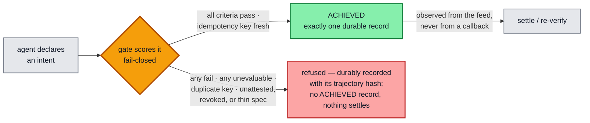
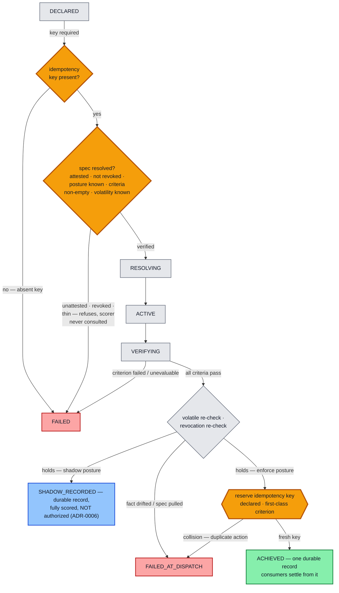
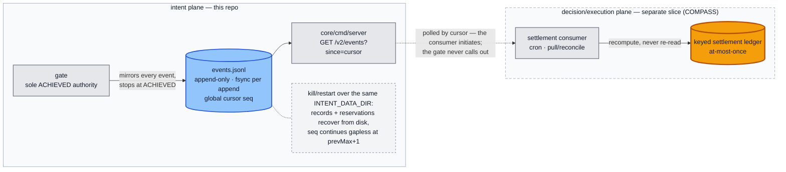

# Architecture — how the plane works

Companion to the root `README.md`; normative language lives in `CONTRACT.md`.
This page: the three commitments in full, the decision flow, emit-and-observe,
the signed artifact, and the invariants.

## The three commitments, in full

**1 · One signed object.** Governance, control, and enforcement bind to a
single content-addressed, signed specification: the bytes an officer attests
are the bytes the gate executes — equality of cryptographic hashes, not
alignment of three documents. The wire carries **no criteria** (the field
does not exist in the request DTO; the old shape gets a loud 400). The
**declarant** — the caller declaring the intent — supplies the spec's content
address plus the idempotency key and scope; criteria, action class, and
enforcement posture reach the gate ONLY through `CONTRACT.md` §2.6
resolution: an envelope signed by the **attester**, verified against the
trust root, its payload hashing byte-for-byte to the claimed address.

**2 · Authority is key possession.** The drafting side (the **author** role)
holds no keys and cannot sign, publish, or activate anything; nothing becomes
enforceable until a designated attester signs it — maker-checker discipline
applied to what automated agents act on. Attested artifacts are sealed and
revocable: a signed tombstone withdraws authority, the withdrawal is itself
part of the record, and a tombstone signed by any other key does not revoke.
This SDK's half of the claim is structural: **no signing seat exists anywhere
in this repo** — the core is verification-only and imports no application
package. The deployment half (workload identity) is staged, not built — see
`docs/assurance.md`.

**3 · Fail-closed, twice, with one record.** Every declared intent is scored
pass / fail / unevaluable — which never passes. Missing data denies; volatile
checks are re-verified at the last moment before the consequence fires, and
so is the authority itself (a spec revoked mid-flight stops at the edge). The
authorization and its audit record are one byte-exact event: the record
cannot disagree with the decision, and the decision cannot exist without the
record. The worst case of a drafting error or a data outage is an action that
wrongly waits — never one that wrongly executes (with the guarded test
affordance disabled, its boot flag never set in production — the residual is
recorded in `docs/assurance.md`).

## The decision flow, state by state

The terminal-position record of every completed authorization — grant,
shadow, or refusal — carries its trajectory hash (`CONTRACT.md` §2.3), so a
trimmed or edited log is detectable by recomputation.

## At-most-once by construction

What makes two actions "the same action" is a **declared idempotency key,
treated as a first-class gate criterion** — not adapter-local dedup logic.
The key is required (an absent key is unevaluable and fails closed) and is
reserved at the dispatch edge; a near-duplicate — same key, one changed
field, hence a *different* intent hash — collides on the key and is refused
(`FAILED_AT_DISPATCH`). At-most-once holds on the settlement log by
construction, not by assertion. The key's governance as a signed,
expert-attested criterion lives in the attested spec payload
(`CONTRACT.md` §2.6, per ADR-0007) — the gate consumes and enforces it.

Both `FAILED` and `FAILED_AT_DISPATCH` guarantee **no `ACHIEVED` record
exists** in the durable feed — so no consumer ever settles. The audit reading
is unambiguous: a duplicate or drifted intent ⟹ **no value moved**.

## Emit-and-observe

The gate's job ends at the durable `ACHIEVED` record. Settlement belongs to a
consumer that **pulls** the feed by cursor and recomputes — the gate never
calls out, and a crash on either side loses nothing:

The amber ledger is the consumer-side twin of the gate's amber checkpoints:
the same declared key that gates dispatch keys the settlement ledger, so
at-most-once holds end to end.

## The artifact, precisely

- **Envelope.** DSSE-shaped JSON: `payloadType`, base64 `payload`,
  `signatures` (`keyid` = 16-hex sha256 prefix of the public key; ed25519
  over the v1 pre-authentication encoding; a `key_authority` stamp on every
  signature). Spec payloads and revocation tombstones are the same envelope
  with different payload types.
- **Content address.** The intent-spec hash is sha256 over the raw payload
  bytes inside the envelope. A declaration cites the hash; nothing else on
  the wire can carry policy content.
- **Spec payload.** Strict-decoded: version, action class, enforcement
  posture (`enforce` | `shadow`), criteria (name / threshold / volatility),
  source pins (sha256 of the exact policy passage behind each value), named
  unknowns, and human-judgment entries. Unknown fields refuse. (Thresholds
  are float64 today; the payload schema moves to exact decimal strings
  before R1 — a binding trigger recorded in ADR-0007, because migrating
  content-addressed signed bytes later means re-attesting everything.)
- **Resolution (hybrid rule).** The store is authoritative: a published,
  pinned envelope resolves; a wire-supplied envelope resolves only if it
  verifies against the same trust root, hashes to the claimed address, and
  that address is pinned in the store. Everything else is unattested and
  refuses before scoring. A verified tombstone wins over every other outcome.
- **Terminals.** `ACHIEVED` (one byte-exact record), `FAILED` at scoring,
  `FAILED_AT_DISPATCH` at the edge (volatile drift, idempotency collision,
  or revocation — the cause class names where the error entered), and
  `SHADOW_RECORDED` (fully scored, durably recorded, authorizes nothing,
  reserves nothing).
- **Refusal causes are a closed set.** Absent key, unattested spec, invalid
  posture, unresolved human judgment, empty criteria, invalid volatility,
  revoked-with-reason. Adding a cause is a contract amendment, not a code
  change.

## Invariants (enforced by construction, pinned by tests)

1. The gate is the **sole emitter** of the single `ACHIEVED` record, fsynced to the
   durable feed before success; consumers act only after observing it.
2. **Tri-state, fail-closed** scoring: any `Fail` or `Unevaluable` ⟹ not authorized.
3. **Stable vs volatile**: stable criteria scored once (declaration); volatile scored
   at declaration *and* re-verified at the dispatch edge by the same authority.
4. **Idempotency by construction**: key required; reserved at the dispatch edge; a
   near-duplicate (same key, different intent hash) collides ⟹ `FAILED_AT_DISPATCH`,
   at-most-once on the settlement log.
5. **Determinism / replay**: per-intent logical clock, IDs from the episode seed, no
   wallclock; replay drives **recompute** (not a re-read). The feed's global cursor
   (`seq`) never enters the per-intent trajectory hash.
6. **Durability**: the event feed and the idempotency reservations survive process
   restart over the same `INTENT_DATA_DIR` (kill/restart proven — byte-identical
   events, same-key re-dispatch still refused).
7. **Thin-spec defense** (step 1b): zero criteria ⟹ `FAILED`
   `unevaluable:empty-criteria`; unknown volatility ⟹ `FAILED`
   `unevaluable:invalid-volatility:<name>`. Both refuse **before any scoring** —
   the scorer is never consulted.
8. **Core neutrality, pinned mechanically**: `core/` carries no domain
   vocabulary (`TestCoreNeutrality`), alongside the pinned import boundary and
   role vocabulary — amend `CONTRACT.md` first, then the pinned tables, never
   the reverse.
