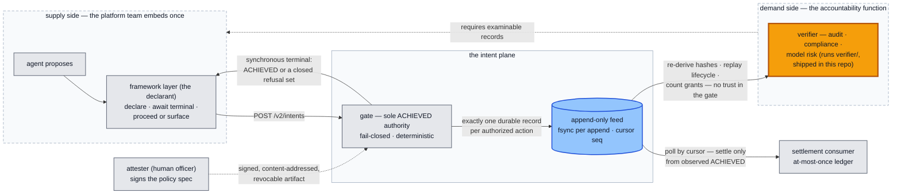

# Assurance — what a reviewer can verify, and what is honestly not yet true

For the accountability function: audit, compliance, model risk, a
counterparty's diligence. Read the system's cost structure as a revealed
preference: per-intent logical clocks with no wallclock, a JSON-free
length-prefixed hash encoding, byte-frozen cross-language fixtures, a durable
fsync before every success, exactly one authorization record per key — none
of it buys anything at decision time. It pays off in exactly one scenario:
when someone who does **not** trust the gate re-derives the record afterward.

## Where the examiner sits

## What the record proves, by stage

The claim grows with the mechanism, and each stage is separable in review:

| Stage | What the record proves | Standing |
|---|---|---|
| Today, from the feed alone | This record is self-consistent and its hashes recompute — in your language, not ours. The terminal-position record of **every** completed authorization — grants, shadow records, and refusals alike — carries its trajectory hash (`CONTRACT.md` §2.3 refusal-hash commitment, pinned by `TestTerminalHashCommitment`), so a trimmed or edited refusal log is detectable by recomputation. | available now |
| + signed specifications | The gate executed the signed specification: criteria cannot arrive except through signature verification and content-address equality. | enforced (test key authority) |
| + record signing | This record was not rewritten: the feed itself becomes tamper-evident. | staged (R1) |
| + workload identity | This gate, and only this gate, produced it: sole-writer as a deployment fact. | staged (R2) |

## What an audit firm can re-run, without trusting the gate

From a decision record plus the feed (`GET /v2/events?since=`), in the
reviewer's own language with no vendor code: recompute the trajectory hash of
an authorization from its event records (the hash path never touches JSON,
which is what makes cross-language recomputation exact rather than
approximate); replay the lifecycle as a walk of the closed transition graph,
every refusal reason drawn from a closed, pinned vocabulary; prove
at-most-once — exactly one authorization record per idempotency key across
the entire feed, sequence numbers gap-free; bind records to declarations via
the deterministic intent identity; and check the witnesses — which scoring
authority answered (`scorer_id`), which key attested the specification.

**And they don't have to start from prose:** this SDK ships the independent
verifier (`verifier/` — a Go package plus `cmd/intent-verify`, and a
stdlib-only Python twin in `verifier/pyverifier/`). The twins' canonical
reports are byte-compared; a golden feed fixture ships with a tampered
standing mutant (one flipped byte must refute, forever, in both languages)
and frozen expected reports under `core/contract/feed/` (`CONTRACT.md` §9.1);
an import pin proves the verifier tree runs none of the gate's code
(§7.1 — it imports nothing from this module outside its own tree); and the
testing monorepo's quickstart probe 9 runs both twins over a live feed and
byte-compares their reports. The traps an independent implementation must
mind are pinned by that fixture rather than only listed here: length prefixes
are **byte** lengths (not code points), `scorer_id` and the global `seq` are
**hash-exempt** feed fields, and the store tolerates CRLF and a torn trailing
line. Verdicts are tri-state like the gate itself — verified, refuted,
unverifiable — and unverifiable never passes (the twins' first live run
refuted a correct feed by demanding an optional field; the ruling that
absence-of-an-optional-passthrough is never a finding is itself
fixture-pinned).

**Stated honestly, what it proves today:** the record is self-consistent and
its hashes recompute. Not yet provable: that the log was never rewritten
(record signing, R1) or that the gate was the sole writer (workload
identity, R2) — those rows below carry their own standing.

## Claim-to-mechanism map

Every load-bearing claim, with its current standing. **enforced & pinned** =
a failing test refutes the claim; **built · test-grade** = the mechanism
runs, with a named production blocker; **staged · asserted** = recorded
intent, not demonstrated. The separation is deliberate: nothing below asks to
be believed. (P-numbers are the premise clauses from the intent-plane spec;
normative role vocabulary — declarant / author / attester / gate — is
`CONTRACT.md` §1.)

| Claim | Status | Mechanism / boundary |
|---|---|---|
| One signed object — attested bytes are executed bytes (P1) | **enforced & pinned** (test key authority) | The wire has NO criteria field (`core/cmd/server/main.go` `specDTO`; the old shape 400s). Criteria reach the gate only through §2.6 resolution: ed25519 envelope verification + content-address equality (`plane/store.go` `Resolve`); an unattested hash refuses before any scoring (`TestUnattestedSpecRefuses`); a single flipped payload byte refuses verification (`TestTamperedPayloadRefuses`). |
| Artifacts are the only crossings (P2) | enforced gate-side | Four routes only (`newMux`) + the durable feed; the core package set and import adjacency pinned mechanically (`TestImportBoundary`). |
| Authority is key possession — the drafting side cannot sign (P3) | **code graph enforced · deployment graph staged** | This repo contains no signing seat at all: the core is verification-only and imports no application package (`TestImportBoundary`). Applications bring their own seats under a name-free rule: any `<tree>/authority` is importable only from `<tree>/control` (`TestKeyPossessionBoundary`). stdlib crypto stays reachable by any Go code, so "cannot sign at all" is the DEPLOYMENT half (workload identity, R2) — asserted, not demonstrated. |
| Sealed, revocable artifact; the attester is author of record | **enforced & pinned** | Attestation seals the payload under the attester's key (keyid witnessed in resolution). Revocation is a signed tombstone; a forged tombstone does not revoke (`TestForgedTombstoneDoesNotRevoke`); revocation is checked at declaration AND re-checked at the dispatch edge, with the tombstone's reason carried into the refusal (`TestRevokedResolutionWinsOverUnattested`). |
| Tri-state verdicts; unevaluable never passes (P4) | **enforced & pinned** | Closed scoring domain; every transport/decode/non-2xx error ⇒ `Unevaluable` (`core/internal/scoring/scorer.go`). The zero-configuration deployment authorizes nothing: no trust root ⇒ every spec unattested; no scorer ⇒ every criterion unevaluable. |
| Last-moment re-verification of stale checks | **enforced & pinned** | Volatile criteria re-scored at the dispatch edge; any non-pass stops with the distinct `FAILED_AT_DISPATCH` terminal naming where the error entered. Authority gets the same treatment (revocation re-check). |
| One byte-exact event — record and decision inseparable (P5) | **enforced & pinned** | The `ACHIEVED` event and its durable record are one emit; replay from the same inputs is byte-identical (`TestDeterminismReplay`). Every SCORED/RECHECK record carries a `scorer_id` witness, so a test-forced decision is never byte-indistinguishable from a live one — and `force_scores` itself is guarded (`INTENT_UNSAFE_FORCE_SCORES=1` at boot, else a loud 400). |
| Standard signing envelopes, independently verifiable | built · test-grade | DSSE-shaped envelopes (PAE v1, ed25519) verifiable by standard tooling. Key authority is test-grade and every signature says so (`key_authority: "test"`); production key management (ADR-0009 / R1) is the named blocker before this row reads "enforced". |
| Role separation enforced by workload identity | staged · asserted | Not built. Today's separation is the code-graph fact above (R2). |
| Logs index, gates decide | record authority built · trace export staged | The durable feed is the sole authority and the exportable index (cursor reads, per-intent replay). Push-based OTel emission is staged (R4), permitted only if trivially additive. |
| Staged rollout, itself signed — shadow until promoted | built · test-grade | Enforcement posture lives inside the signed payload; shadow runs are fully scored and durably recorded but authorize nothing and reserve nothing (`SHADOW_RECORDED`). Promotion is a fresh attestation producing a new hash — an authority act, never a config toggle. The governance decision recording this terminal (ADR-0006) is Proposed, not ratified. |
| Judgment routed to humans; abstention is the system working (P6) | gate-side **enforced & pinned** · chassis application-side | `Unevaluable` is a first-class score, and an unresolved `human_judgment` entry refuses (`unevaluable:human-judgment:<name>`, `TestHumanJudgmentRefuses`) — an invented number cannot replace a human decision. The authoring chassis that routes obligations into those entries is application-side (reference: the testing monorepo) and its guarantees are not yet test-backed there; the drafting intelligence that fills the seat is future work. |
| Thin-spec defense — attestation does not launder vacuity (P7) | **enforced & pinned** | Zero criteria ⇒ `FAILED unevaluable:empty-criteria`; unknown volatility ⇒ `FAILED unevaluable:invalid-volatility:<name>` — both refuse BEFORE any scoring (`TestFailClosedEmptyCriteria`, `TestFailClosedInvalidVolatility`); "no criterion failed" is never satisfied by "no criterion existed". |
| Every completed authorization commits to its trajectory — refusals included | **enforced & pinned** | The terminal-position feed record carries `trajectory_hash` computed over the complete per-intent log including the final event; no non-terminal record carries one (§2.3; `TestTerminalHashCommitment`, mutant: stamp the hash one event early). Residual, honestly: step-1 refusals log no `FAILED` transition *event* — the trajectory is committed, but for those paths the terminal classification lives in the synchronous response, not the feed. |
| The record can be re-derived without trusting the gate | built · test-grade | `verifier/` twins (Go + stdlib-only Python), byte-compared canonical reports, tri-state verdicts where unverifiable never passes (§9.1); frozen good/tampered fixtures with the tampered mutant standing guard (`core/contract/feed/`), generator-tested against the real gate so the fixture can never drift; §7.1 import pin — the examiner's recomputation is a genuinely second implementation. What it proves is bounded by the stage table above: self-consistency now; never-rewritten and sole-writer arrive with R1/R2. |

## Known production-posture gaps, recorded rather than hidden

(The ROADMAP lives in the testing monorepo, `treasury-intent-controller`,
under `docs/ROADMAP.md`.) `force_scores` is guarded and witnessed but remains
a total scoring bypass wherever the boot flag is set; key authority is
test-grade until ADR-0009; workload identity (R2) is asserted; the feed read
surface is unauthenticated by design (network isolation is a deployment
decision); with more than one key in a trust root, revocation authority is flat
(any root key revokes any spec) — a who-may-revoke theory is ADR-0009 scope.

## What a reviewer can re-run — and where

**In this repo:** the import-boundary gate pins the core package graph, the
name-free key-possession rule, and the verifier tree's imports-nothing rule;
the determinism gate replays a full lifecycle and byte-compares the records;
the tamper gate flips one payload byte and watches verification refuse; the
feed-fixture lanes run both verifier twins over the frozen good and tampered
fixtures and byte-compare their reports (`go test ./verifier`,
`core/scorer/.venv` python `-m pytest verifier/pyverifier`), and the
generator test re-drives the good fixture through the real gate; the
contractcheck six (boundary, key-possession, neutrality, vocabulary presence,
forbidden nouns, retired noun) run inside the named gate (see the root
README's build section).

**In the testing monorepo** (`github.com/hossainpazooki/treasury-intent-controller`):
the end-to-end probe ladder runs the whole plane — keygen, attest, publish,
authorize against a signed spec, collide on idempotency, refuse an unattested
hash, revoke and watch the reason surface, kill the scorer and watch the
system deny, then re-derive the whole live feed with both verifier twins and
byte-compare their reports — in one command, self-asserting, against the
live scoring service (`treasury/quickstart.ps1` / `.sh`, expected final line
`RESULT: 9/9 probes passed`).
